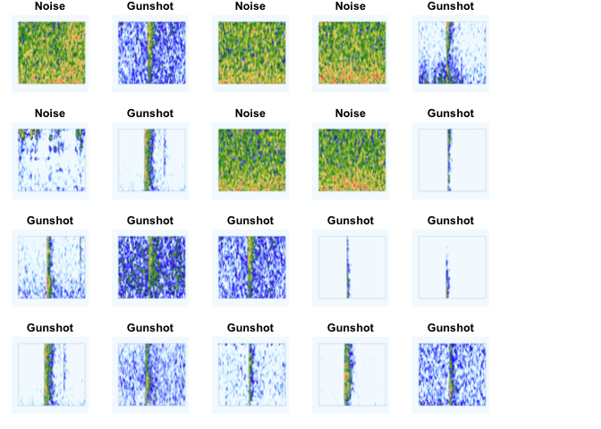
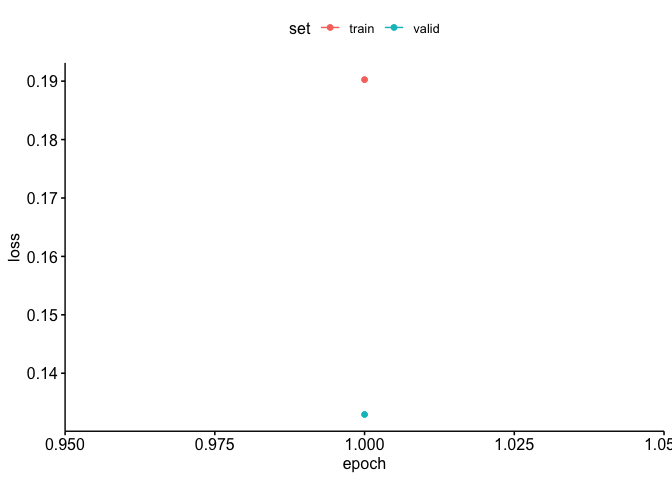
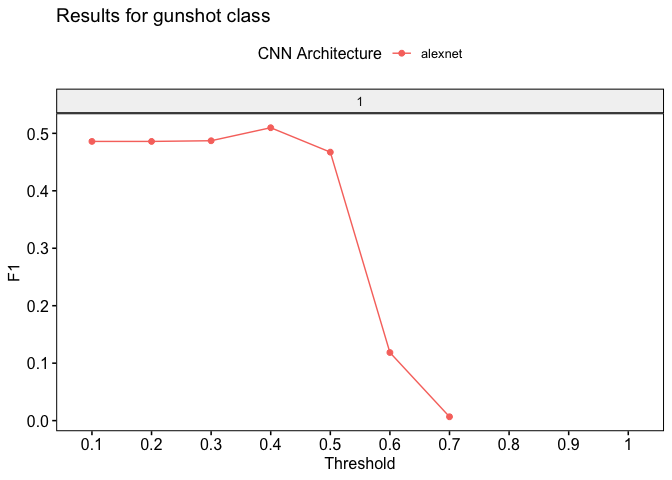

Gunshot Detection with AlexNet, VGG16, and ResNet18 using ‘torch for R’
================

<!-- README.md is generated from README.Rmd. Please edit that file -->

This repository contains code for training and evaluating a gunshot
detection model using the AlexNet, VGG16, and ResNet18 convolutional
neural network architecture. The model is trained on the Imagenet
dataset and fine-tuned for the specific task of gunshot detection. The
code utilizes the ‘luz’ package in R for deep learning with torch.

This analysis uses the ‘gibbonNetR’ package, which can be accessed here:
<https://github.com/DenaJGibbon/gibbonNetR>.

## Dataset

The dataset used for training, validation, and testing is obtained from
sound clips of annotated PAM data, and includes labeled images of
gunshots and noise. The images are preprocessed using various
transformations, such as resizing, color jitter, and normalization, to
prepare them for input into the model.

<!-- -->

## Training

The training process involves fine-tuning the pretrained AlexNet, VGG16,
and ResNet18 models by training new classifier layers. The model is set
up with a binary cross-entropy loss function and the Adam optimizer.
Training can be performed for 1-5 epochs or 20 epochs (or as many as you
want) with early stopping enabled to prevent overfitting.

The trained model is saved for future use.

``` r

# Location of spectrogram images for training
input.data.path <-  'data/imagesvietnamunbalanced/'

# Location of spectrogram images for testing
test_data_path <- '/Users/denaclink/Desktop/RStudioProjects/Vietnam-Gunshots/data/imagesbelize/train/'

# Training data folder short
trainingfolder.short <- 'imagesvietnamunbalanced'

# Number of epochs to include
epoch.iterations <- c(1)

# Train the models specifying different architectures
architectures <- c('alexnet')
freeze.param <- c(FALSE)
for (a in 1:length(architectures)) {
  for (b in 1:length(freeze.param)) {
    gibbonNetR::train_CNN_binary(
      input.data.path = input.data.path,
      noise.weight = 0.25,
      architecture = architectures[a],
      save.model = TRUE,
      learning_rate = 0.001,
      test.data = test_data_path,
      unfreeze.param = freeze.param[b],
      # FALSE means the features are frozen
      epoch.iterations = epoch.iterations,
      list.thresholds = seq(0, 1, .1),
      early.stop = "yes",
      output.base.path = "model_output_testonbelize/",
      trainingfolder = trainingfolder.short,
      positive.class = "gunshot",
      negative.class = "noise"
    )
    
  }
}
#> [1] "Training alexnet"
#> [1] "Postive class = gunshot  and Negative class = noise"
```

<!-- -->

    #> [1] "Here are actual class labels, if they do not contain the positive or negative class cannot evaluate model performance: gunshot"
    #> [2] "Here are actual class labels, if they do not contain the positive or negative class cannot evaluate model performance: noise"

## Evaluation

To evaluate the performance of the trained model, the test dataset is
used. The images in the test dataset are preprocessed in the same way as
during training. The model predicts the probability of an image
belonging to the positive class (gunshot) and calculates the F1 score as
the evaluation metric.

``` r
performancetables.dir.multi.testbelize <- '/Users/denaclink/Desktop/RStudioProjects/Vietnam-Gunshots/model_output_testonbelize/_imagesvietnamunbalanced_binary_unfrozen_FALSE_/performance_tables'
PerformanceOutputmulti.testbelize <- gibbonNetR::get_best_performance(performancetables.dir=performancetables.dir.multi.testbelize,
                                                                           class='gunshot',
                                                                           model.type = "binary",
                                                                           Thresh.val = 0.1)
#> [1] "Best F1 results"
#> [1] "gunshot"
#>   Sensitivity Specificity Pos Pred Value Neg Pred Value Precision    Recall
#> 1   0.9043624   0.2902458      0.3758717      0.8652482 0.3758717 0.9043624
#>          F1 Prevalence Detection Rate Detection Prevalence Balanced Accuracy
#> 1 0.5310345  0.3209478      0.2902531            0.7722132         0.5973041
#>   Validation loss           Training Data N epochs CNN Architecture Threshold
#> 1       0.1432444 imagesvietnamunbalanced        1          alexnet       0.4
#>         AUC Frozen   Class
#> 1 0.6034908  FALSE gunshot
#> [1] "Best Precision results"
#>   Sensitivity Specificity Pos Pred Value Neg Pred Value Precision      Recall
#> 1 0.005033557           1              1       0.680151         1 0.005033557
#>           F1 Prevalence Detection Rate Detection Prevalence Balanced Accuracy
#> 1 0.01001669  0.3209478    0.001615509          0.001615509         0.5025168
#>   Validation loss           Training Data N epochs CNN Architecture Threshold
#> 1       0.1432444 imagesvietnamunbalanced        1          alexnet       0.6
#>         AUC Frozen   Class
#> 1 0.6034908  FALSE gunshot
#> [1] "Best Recall results"
#>   Sensitivity Specificity Pos Pred Value Neg Pred Value Precision Recall
#> 1           1  0.01506741      0.3242655              1 0.3242655      1
#>          F1 Prevalence Detection Rate Detection Prevalence Balanced Accuracy
#> 1 0.4897288  0.3209478      0.3209478            0.9897684         0.5075337
#>   Validation loss           Training Data N epochs CNN Architecture Threshold
#> 1       0.1432444 imagesvietnamunbalanced        1          alexnet       0.3
#>         AUC Frozen   Class
#> 1 0.6034908  FALSE gunshot
#> [1] "Best AUC results"
#>   Sensitivity Specificity Pos Pred Value Neg Pred Value Precision Recall
#> 1           1           0      0.3209478             NA 0.3209478      1
#>          F1 Prevalence Detection Rate Detection Prevalence Balanced Accuracy
#> 1 0.4859356  0.3209478      0.3209478                    1               0.5
#>   Validation loss           Training Data N epochs CNN Architecture Threshold
#> 1       0.1432444 imagesvietnamunbalanced        1          alexnet       0.1
#>         AUC Frozen   Class
#> 1 0.6034908  FALSE gunshot

PerformanceOutputmulti.testbelize$f1_plot
#> Warning: Removed 4 rows containing missing values or values outside the scale range
#> (`geom_line()`).
#> Warning: Removed 4 rows containing missing values or values outside the scale range
#> (`geom_point()`).
```

<!-- -->

``` r
PerformanceOutputmulti.testbelize$best_f1$F1
#> [1] 0.5310345
PerformanceOutputmulti.testbelize$best_auc$AUC
#> [1] 0.6034908
```

## Usage

To use the trained model for predictions without the ‘gibbonNetR’
package, load the saved model using the ‘luz_load’ function. Then,
preprocess the input image(s) in the same way as during training and
pass them to the model for prediction. The output will be the predicted
class label or probability.

``` r
# Load libraries
library(luz)
library(torch)
library(torchvision)
library(torchdatasets)
library(stringr)
library(caret)

# Load the saved model
modelAlexnetGunshot <- luz_load("_train_1_modelAlexnet.pt")

# Set the input directory for the test images
test.input <- 'data/images/test'

# Get the list of image files
imageFileShort <- list.files(test.input, recursive = TRUE, full.names = FALSE)

# Identify just the class from folder structure
ActualClass <- str_split_fixed( imageFileShort,pattern = '/',n=2)[,1]

# Create a dataset from the image folder
test_ds <- image_folder_dataset(
  file.path(test.input),
  transform = . %>%
    torchvision::transform_to_tensor() %>%  # Convert images to tensors
    torchvision::transform_resize(size = c(224, 224)) %>%  # Resize images to 224x224 pixels
    torchvision::transform_normalize(mean = c(0.485, 0.456, 0.406), std = c(0.229, 0.224, 0.225)),  # Normalize the image tensor
  target_transform = function(x) as.double(x) - 1  # Transform the target variable to be zero-based
)

# Get the number of test files
nfiles <- test_ds$.length()

# Create a dataloader for the test dataset with a specified batch size
test_dl <- dataloader(test_ds, batch_size = nfiles)

# Use the Alexnet model to predict the test images
alexnetPred <- predict(modelAlexnetGunshot, test_dl)

# Apply the sigmoid function to the predicted values
alexnetProb <- torch_sigmoid(alexnetPred)

# Convert the predicted probabilities to an R array and subtract from 1
alexnetProb <- 1 - as_array(torch_tensor(alexnetProb, device = 'cpu'))

# Classify the images as "gunshot" or "noise" based on a probability threshold
alexnetPredictedClass <- ifelse((alexnetProb) > 0.85, "gunshot", "noise")

# Create a confusion matrix
AlexnetPerf <- caret::confusionMatrix(as.factor(alexnetPredictedClass),as.factor(ActualClass), mode='everything')

print(AlexnetPerf$table)
```

## Acknowledgments

This project was inspired by the work of Keydana (2023) on image
classification with transfer learning. Special thanks to the ‘torch’
package authors for providing the framework for deep learning in R with
PyTorch.

## References

Keydana, Sigrid. Deep Learning and Scientific Computing with R torch.
CRC Press, 2023.
<https://skeydan.github.io/Deep-Learning-and-Scientific-Computing-with-R-torch/>
